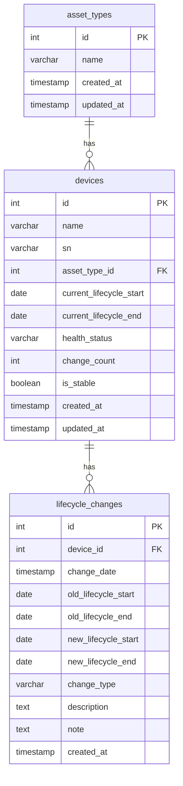

# 设备资产管理系统数据库设计

## 1. 数据库设计概述

本设计基于设备生命周期全景监控系统的需求，旨在存储和管理设备的基本信息、生命周期轨迹、变更记录等数据。系统需要支持设备信息的分页查询、搜索、排序等功能，以及完整的变更历史记录。

## 2. 数据库表结构

### 2.1 资产类型表 (`asset_types`)

| 字段名         | 数据类型        | 约束                                                      | 描述                           |
| :------------- | :-------------- | :-------------------------------------------------------- | :----------------------------- |
| `id`         | `INT`         | `PRIMARY KEY AUTO_INCREMENT`                            | 资产类型ID                     |
| `name`       | `VARCHAR(50)` | `UNIQUE NOT NULL`                                       | 资产类型名称（如：设备、配件） |
| `created_at` | `TIMESTAMP`   | `DEFAULT CURRENT_TIMESTAMP`                             | 创建时间                       |
| `updated_at` | `TIMESTAMP`   | `DEFAULT CURRENT_TIMESTAMP ON UPDATE CURRENT_TIMESTAMP` | 更新时间                       |

### 2.2 设备信息表 (`devices`)

| 字段名                      | 数据类型         | 约束                                                      | 描述                                     |
| :-------------------------- | :--------------- | :-------------------------------------------------------- | :--------------------------------------- |
| `id`                      | `INT`          | `PRIMARY KEY AUTO_INCREMENT`                            | 设备ID                                   |
| `name`                    | `VARCHAR(100)` | `NOT NULL`                                              | 设备名称                                 |
| `sn`                      | `VARCHAR(100)` | `UNIQUE NOT NULL`                                       | 设备编码（序列号）                       |
| `asset_type_id`           | `INT`          | `FOREIGN KEY REFERENCES asset_types(id)`                | 资产类型ID                               |
| `current_lifecycle_start` | `DATE`         | `NOT NULL`                                              | 当前生命周期开始日期                     |
| `current_lifecycle_end`   | `DATE`         | `NOT NULL`                                              | 当前生命周期结束日期                     |
| `health_status`           | `VARCHAR(50)`  | `NOT NULL`                                              | 数据健康状态（如：今日已更新、数据稳定） |
| `change_count`            | `INT`          | `DEFAULT 0`                                             | 变更次数                                 |
| `is_stable`               | `BOOLEAN`      | `DEFAULT TRUE`                                          | 是否稳定（无变更）                       |
| `created_at`              | `TIMESTAMP`    | `DEFAULT CURRENT_TIMESTAMP`                             | 创建时间                                 |
| `updated_at`              | `TIMESTAMP`    | `DEFAULT CURRENT_TIMESTAMP ON UPDATE CURRENT_TIMESTAMP` | 更新时间                                 |

### 2.3 生命周期变更记录表 (`lifecycle_changes`)

| 字段名                  | 数据类型         | 约束                                   | 描述                               |
| :---------------------- | :--------------- | :------------------------------------- | :--------------------------------- |
| `id`                  | `INT`          | `PRIMARY KEY AUTO_INCREMENT`         | 变更记录ID                         |
| `device_id`           | `INT`          | `FOREIGN KEY REFERENCES devices(id)` | 设备ID                             |
| `change_date`         | `TIMESTAMP`    | `NOT NULL`                           | 变更时间                           |
| `old_lifecycle_start` | `DATE`         | `NOT NULL`                           | 变更前生命周期开始日期             |
| `old_lifecycle_end`   | `DATE`         | `NOT NULL`                           | 变更前生命周期结束日期             |
| `new_lifecycle_start` | `DATE`         | `NOT NULL`                           | 变更后生命周期开始日期             |
| `new_lifecycle_end`   | `DATE`         | `NOT NULL`                           | 变更后生命周期结束日期             |
| `change_type`         | `VARCHAR(100)` | `NOT NULL`                           | 变更类型（如：数据同步：时间偏移） |
| `description`         | `TEXT`         | `NOT NULL`                           | 变更描述                           |
| `note`                | `TEXT`         |                                        | 变更备注                           |
| `created_at`          | `TIMESTAMP`    | `DEFAULT CURRENT_TIMESTAMP`          | 创建时间                           |

## 3. 索引设计

为了优化查询性能，特别是支持搜索和排序操作，设计以下索引：

### 3.1 设备信息表索引

| 索引名                        | 索引类型   | 字段              | 说明               |
| :---------------------------- | :--------- | :---------------- | :----------------- |
| `idx_devices_sn`            | `UNIQUE` | `sn`            | 加速设备编码搜索   |
| `idx_devices_name`          | `INDEX`  | `name`          | 加速设备名称搜索   |
| `idx_devices_asset_type`    | `INDEX`  | `asset_type_id` | 加速按资产类型筛选 |
| `idx_devices_change_count`  | `INDEX`  | `change_count`  | 加速按变更次数排序 |
| `idx_devices_health_status` | `INDEX`  | `health_status` | 加速按健康状态筛选 |

### 3.2 生命周期变更记录表索引

| 索引名                           | 索引类型  | 字段            | 说明                   |
| :------------------------------- | :-------- | :-------------- | :--------------------- |
| `idx_lifecycle_changes_device` | `INDEX` | `device_id`   | 加速查询设备的变更历史 |
| `idx_lifecycle_changes_date`   | `INDEX` | `change_date` | 加速按变更时间排序     |

## 4. 关系图



## 5. 数据操作示例

### 5.1 插入资产类型

```sql
INSERT INTO asset_types (name) VALUES ('设备'), ('配件');
```

### 5.2 插入设备信息

```sql
INSERT INTO devices (name, sn, asset_type_id, current_lifecycle_start, current_lifecycle_end, health_status, change_count, is_stable)
VALUES ('伺服电机控制单元 V3', 'SN: 2026-X-9901', 1, '2026-03-03', '2026-12-31', '今日已更新', 1, false);
```

### 5.3 记录生命周期变更

```sql
INSERT INTO lifecycle_changes (device_id, change_date, old_lifecycle_start, old_lifecycle_end, new_lifecycle_start, new_lifecycle_end, change_type, description, note)
VALUES (1, '2026-03-03 04:00:00', '2026-03-03', '2026-03-03', '2026-03-03', '2026-12-31', '数据同步：时间偏移', '生命周期日期由 2026-03-03 修正为 2026-12-31', '由于硬件维保记录更新，预测寿命自动顺延');

-- 更新设备信息
UPDATE devices SET 
    current_lifecycle_end = '2026-12-31',
    health_status = '今日已更新',
    change_count = change_count + 1,
    is_stable = false
WHERE id = 1;
```

### 5.4 查询设备列表（支持分页、搜索、排序）

```sql
-- 基础查询
SELECT d.id, d.name, d.sn, at.name as asset_type, d.current_lifecycle_start, d.current_lifecycle_end, d.health_status, d.change_count
FROM devices d
JOIN asset_types at ON d.asset_type_id = at.id
WHERE d.name LIKE '%电机%' OR d.sn LIKE '%2026%'
ORDER BY d.change_count DESC
LIMIT 10 OFFSET 0;
```

### 5.5 查询设备变更历史

```sql
SELECT lc.change_date, lc.old_lifecycle_start, lc.old_lifecycle_end, lc.new_lifecycle_start, lc.new_lifecycle_end, lc.change_type, lc.description, lc.note
FROM lifecycle_changes lc
WHERE lc.device_id = 1
ORDER BY lc.change_date DESC;
```

## 6. 性能优化建议

1. **使用连接池**：在应用程序中使用数据库连接池，减少连接建立和关闭的开销。
2. **合理使用缓存**：对于频繁访问的设备信息，可以使用缓存（如Redis）来减少数据库查询。
3. **批量操作**：对于批量更新或插入操作，使用批量SQL语句或事务来提高性能。
4. **定期清理**：定期清理过期的变更记录或归档历史数据，保持数据库大小合理。
5. **监控和调优**：定期监控数据库性能，根据实际使用情况调整索引和查询语句。

## 7. 扩展性考虑

1. **分表分库**：当设备数量达到一定规模时，可以考虑按设备类型或时间范围进行分表分库。
2. **读写分离**：对于读多写少的场景，可以考虑使用主从复制实现读写分离。
3. **NoSQL集成**：对于非结构化数据或需要快速查询的场景，可以考虑集成NoSQL数据库。
4. **API设计**：设计RESTful API接口，支持前端的各种操作，包括分页、搜索、排序等。

## 8. 安全考虑

1. **参数化查询**：使用参数化查询防止SQL注入攻击。
2. **权限控制**：实现基于角色的权限控制，限制对数据库的访问。
3. **数据加密**：对敏感数据（如设备编码）进行加密存储。
4. **审计日志**：记录对数据库的操作，便于追踪和审计。

## 9. 分页查询接口设计

### 9.1 接口概述

根据前端实现需求，设计一个RESTful API接口，支持设备信息的分页查询、搜索和排序功能。

### 9.2 接口设计

#### 9.2.1 接口URL

```
GET /api/devices
```

#### 9.2.2 请求参数

| 参数名 | 类型 | 必填 | 默认值 | 描述 |
| :--- | :--- | :--- | :--- | :--- |
| `page` | `integer` | 否 | `1` | 页码 |
| `pageSize` | `integer` | 否 | `10` | 每页记录数 |
| `search` | `string` | 否 | `""` | 搜索关键字（设备名称、编码或资产类型） |
| `sortBy` | `string` | 否 | `null` | 排序字段（目前仅支持 `change_count`） |
| `sortOrder` | `string` | 否 | `asc` | 排序方向（`asc` 或 `desc`） |

#### 9.2.3 响应格式

```json
{
  "code": 200,
  "message": "success",
  "data": {
    "list": [
      {
        "id": 1,
        "name": "伺服电机控制单元 V3",
        "sn": "SN: 2026-X-9901",
        "assetType": "设备",
        "lifecycle": {
          "old": "2026-03-03",
          "new": "2026-12-31",
          "note": "2026-03-03 凌晨同步"
        },
        "healthStatus": "今日已更新",
        "changeCount": 1,
        "isStable": false
      },
      // 更多设备...
    ],
    "pagination": {
      "total": 15,
      "page": 1,
      "pageSize": 10,
      "totalPages": 2
    }
  }
}
```

### 9.3 示例请求

#### 9.3.1 普通分页查询

```
GET /api/devices?page=1&pageSize=10
```

#### 9.3.2 搜索关键字分页查询

```
GET /api/devices?page=1&pageSize=10&search=电机
```

#### 9.3.3 按变更次数升序分页查询

```
GET /api/devices?page=1&pageSize=10&sortBy=change_count&sortOrder=asc
```

#### 9.3.4 按变更次数降序分页查询

```
GET /api/devices?page=1&pageSize=10&sortBy=change_count&sortOrder=desc
```

### 9.4 实现建议

1. **参数验证**：在服务端对请求参数进行验证，确保参数类型和范围正确。

2. **查询构建**：根据请求参数构建SQL查询，支持动态条件拼接。

3. **性能优化**：
   - 使用索引加速查询
   - 避免全表扫描
   - 合理设置分页大小，避免一次查询过多数据

4. **错误处理**：对可能的错误进行捕获和处理，返回友好的错误信息。

5. **缓存策略**：对于频繁查询的数据，可以考虑使用缓存来提高性能。

### 9.5 后端实现示例（Node.js + Express + MySQL）

```javascript
// 设备查询接口
app.get('/api/devices', async (req, res) => {
  try {
    // 获取请求参数
    const page = parseInt(req.query.page) || 1;
    const pageSize = parseInt(req.query.pageSize) || 10;
    const search = req.query.search || '';
    const sortBy = req.query.sortBy || null;
    const sortOrder = req.query.sortOrder || 'asc';
    
    // 构建查询条件
    let whereClause = '';
    if (search) {
      whereClause = `WHERE name LIKE '%${search}%' OR sn LIKE '%${search}%' OR asset_type LIKE '%${search}%'`;
    }
    
    // 构建排序语句
    let orderClause = '';
    if (sortBy === 'change_count') {
      orderClause = `ORDER BY change_count ${sortOrder}`;
    }
    
    // 计算偏移量
    const offset = (page - 1) * pageSize;
    
    // 查询设备列表
    const devicesQuery = `
      SELECT id, name, sn, asset_type, lifecycle_old, lifecycle_new, lifecycle_note, health_status, change_count, is_stable
      FROM devices
      ${whereClause}
      ${orderClause}
      LIMIT ${pageSize} OFFSET ${offset}
    `;
    
    // 查询总数
    const countQuery = `
      SELECT COUNT(*) as total
      FROM devices
      ${whereClause}
    `;
    
    // 执行查询
    const [devices] = await pool.query(devicesQuery);
    const [countResult] = await pool.query(countQuery);
    const total = countResult[0].total;
    
    // 格式化响应数据
    const formattedDevices = devices.map(device => ({
      id: device.id,
      name: device.name,
      sn: device.sn,
      assetType: device.asset_type,
      lifecycle: {
        old: device.lifecycle_old,
        new: device.lifecycle_new,
        note: device.lifecycle_note
      },
      healthStatus: device.health_status,
      changeCount: device.change_count,
      isStable: device.is_stable
    }));
    
    // 计算总页数
    const totalPages = Math.ceil(total / pageSize);
    
    // 返回响应
    res.json({
      code: 200,
      message: 'success',
      data: {
        list: formattedDevices,
        pagination: {
          total,
          page,
          pageSize,
          totalPages
        }
      }
    });
  } catch (error) {
    console.error('Error querying devices:', error);
    res.status(500).json({
      code: 500,
      message: 'Internal server error'
    });
  }
});
```

## 10. 总结

本数据库设计方案满足了设备资产管理系统的基本需求，包括设备信息管理、生命周期跟踪、变更记录等功能。通过合理的表结构设计、索引优化和性能考虑，系统能够高效地处理设备数据的存储和查询操作。同时，方案也考虑了系统的扩展性和安全性，为未来的功能扩展和数据增长做好了准备。

设计特点：
- **简洁实用**：只包含前端实际使用的字段，避免冗余
- **结构清晰**：表结构设计符合前端数据结构，易于理解和实现
- **性能优化**：通过索引设计和查询优化提高系统性能
- **可扩展性**：考虑了未来数据增长和功能扩展的需求
- **安全性**：提供了多种安全措施保护数据
- **接口设计**：提供了完整的分页查询接口设计，支持搜索和排序功能
